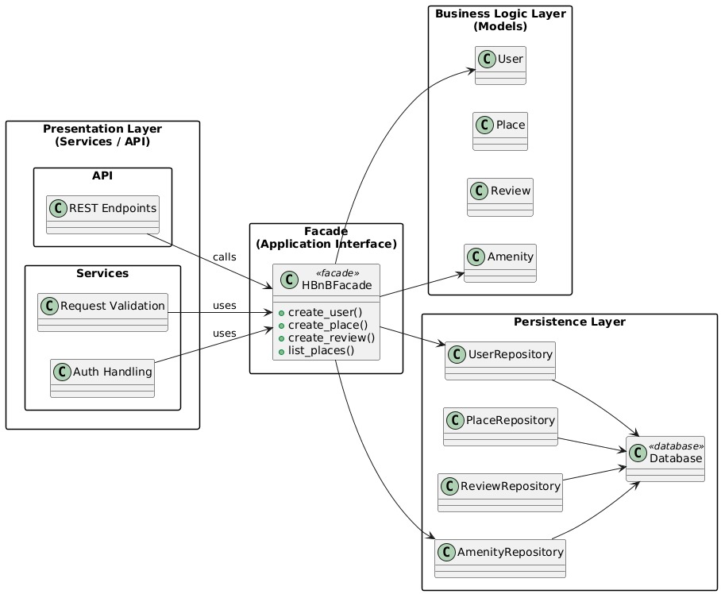

# HBnB - Part 1 (Architecture & UML)

This directory contains the **technical documentation** for the HBnB project (Part 1).  
The goal is to provide a clear blueprint of the system before implementation by documenting:

- The **3-layer architecture** (Presentation / Business Logic / Persistence)
- The **Facade pattern** used to simplify communication between layers
- The **Business Logic entities** (User, Place, Review, Amenity)
- The **sequence flow** for key API calls

---

## Table of Content
- [Overview](#overview)
- [Architecture](#architecture)
  - [High-Level Package Diagram](#high-level-package-diagram)
  - [Explanatory Notes](#explanatory-notes)
- [Business Logic Layer](#business-logic-layer)
  - [Detailed Class Diagram](#detailed-class-diagram)
  - [Entities Notes](#entities-notes)
- [API Interaction Flow](#api-interaction-flow)
  - [User Registration](#user-registration)
  - [Place Creation](#place-creation)
  - [Review Submission](#review-submission)
  - [Fetch Places List](#fetch-places-list)
- [Files](#files)

---

## Overview
HBnB is a simplified AirBnB-like system. This Part 1 documentation focuses on design and UML diagrams
to guide later implementation.

---

## Architecture

### High-Level Package Diagram
The application is organized using a **three-layer architecture**:

1. **Presentation Layer (Services / API)**  
2. **Business Logic Layer (Models)**  
3. **Persistence Layer (Repositories / Database)**  

A **Facade (`HBnBFacade`)** is used as the single entry point from the Presentation layer to the rest
of the application.

#### Diagram (Image)
> Make sure the file name matches your repo file name.



#### Diagram (PlantUML Source)
```plantuml
@startuml
skinparam packageStyle rectangle
left to right direction

package "Presentation Layer\n(Services / API)" {
  package "API" { class "REST Endpoints" }
  package "Services" { class "Request Validation" ; class "Auth Handling" }
}

package "Facade\n(Application Interface)" {
  class HBnBFacade <<facade>> {
    +create_user()
    +create_place()
    +create_review()
    +list_places()
  }
}

package "Business Logic Layer\n(Models)" {
  class User
  class Place
  class Review
  class Amenity
}

package "Persistence Layer" {
  class UserRepository
  class PlaceRepository
  class ReviewRepository
  class AmenityRepository
  class Database <<database>>
}

"REST Endpoints" --> HBnBFacade : calls
"Request Validation" --> HBnBFacade : uses
"Auth Handling" --> HBnBFacade : uses

HBnBFacade --> User
HBnBFacade --> Place
HBnBFacade --> Review
HBnBFacade --> Amenity

HBnBFacade --> UserRepository
HBnBFacade --> PlaceRepository
HBnBFacade --> ReviewRepository
HBnBFacade --> AmenityRepository

UserRepository --> Database
PlaceRepository --> Database
ReviewRepository --> Database
AmenityRepository --> Database
@enduml
